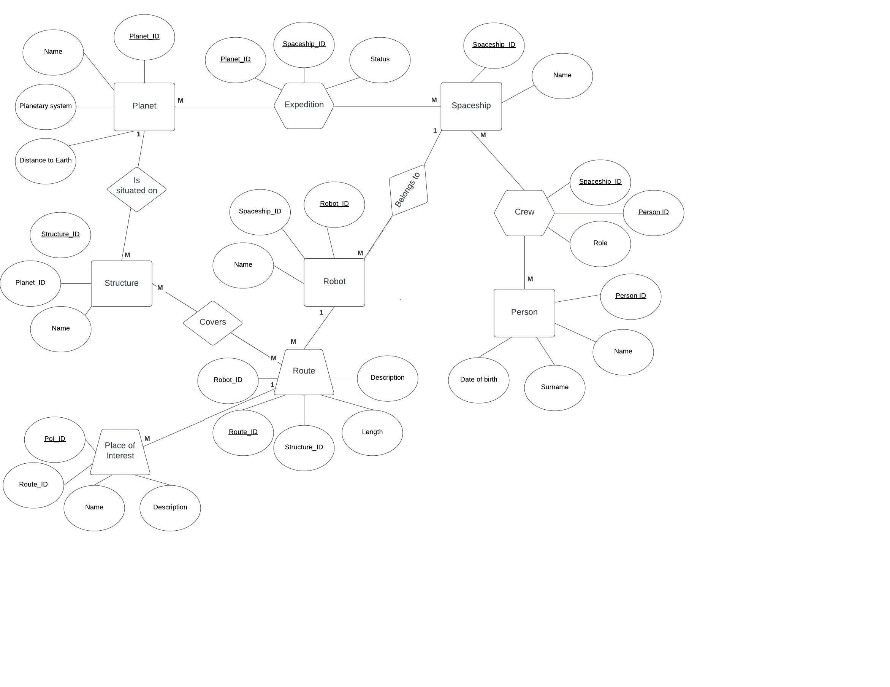
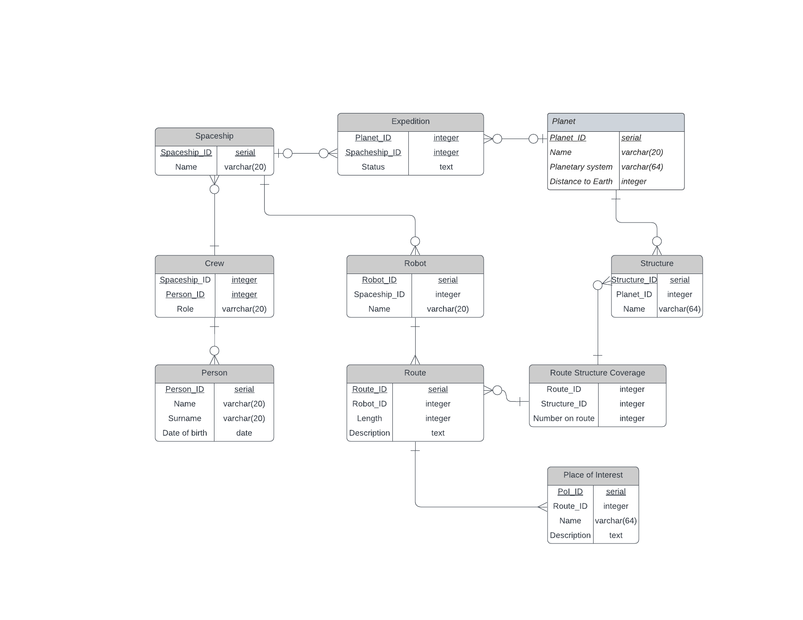

# Лабораторная работа №2 (Граник). Реализация БД  на основе заданной предметной области

Задание:
* На основе предложенной предметной области (текста) составить ее описание. Из полученного описания выделить сущности, их атрибуты и связи.
* Составить инфологическую модель.
* Составить даталогическую модель. При описании типов данных для атрибутов должны использоваться типы из СУБД PostgreSQL.
* Реализовать даталогическую модель в PostgreSQL. При описании и реализации даталогической модели должны учитываться ограничения целостности, которые характерны для полученной предметной области.
* Заполнить созданные таблицы тестовыми данными.

Предметная область: 
*Понадобилось совсем немного времени, чтобы убедиться, что этот мир ничего не в силах им предложить. Сидя перед экраном в корабле, они миля за милей наблюдали пустынные, покрытые слоем пыли коридоры и проходы, которые проплывали перед ними, по мере того как робот исследовал эти безлюдные лабиринты.*

ER-диаграмма

Даталогическая модель

Ссылки:
* [Отчет](./Granik_DB_lab2.pdf)
* [Скрипты DDL и DML](./scripts)
