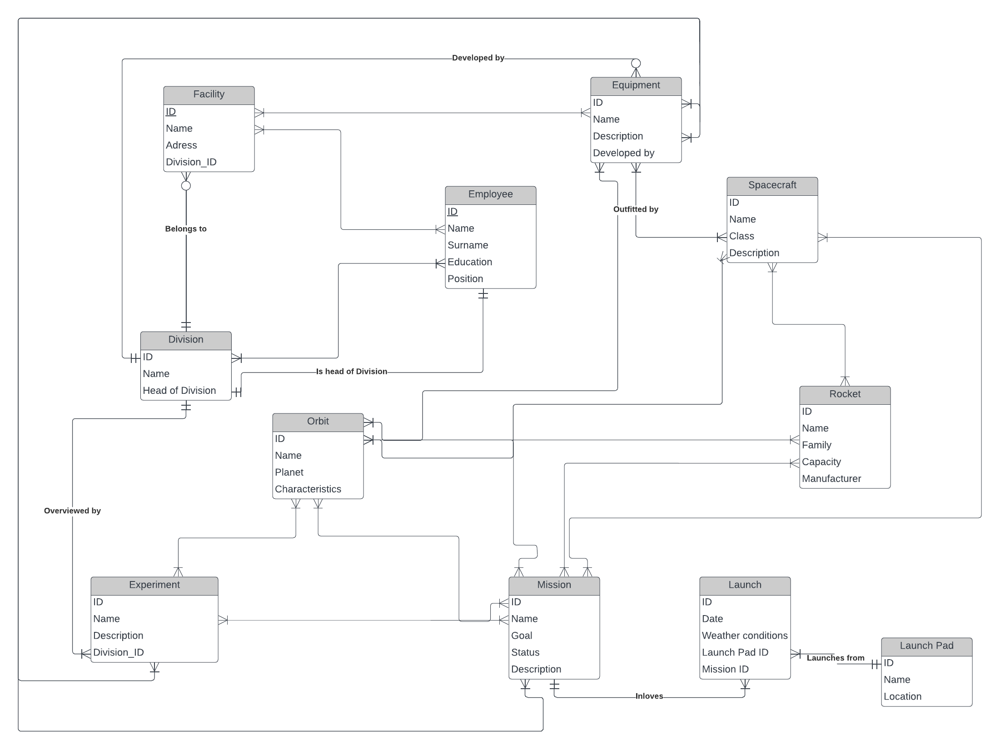
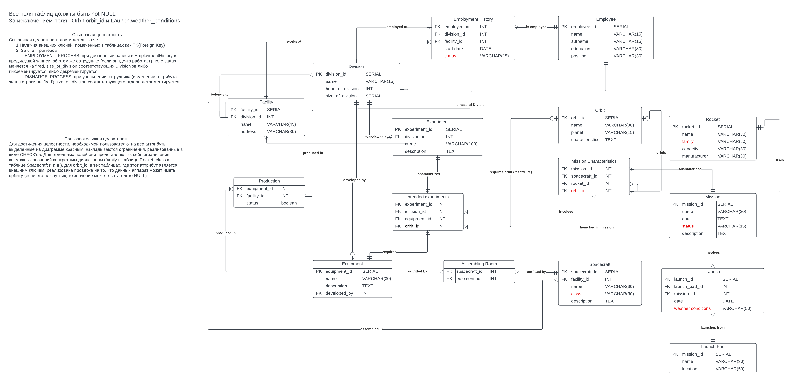

# Лабораторная работа №3. Построение даталогической модели

* Сформировать ER-модель и нарисовать ER-диаграмму предметной области, которая была описана в рамках лабораторной работы №1. ER-модель должна соответствовать описанию, представленному в лабораторной работе №1.
* На основе ER-модели построить даталогическую модель.

[Отчет](./DB_lab3.pdf)

ER-диаграмма

